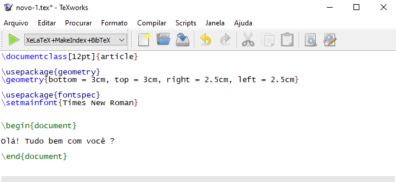

```{r setup, include=FALSE}
knitr::opts_chunk$set(echo = TRUE)
```

# Motivação

Um dos pontos fundamentais do Latex está na utilização de comandos para definir a formatação de seu documento. Porém, o *front-end* padrão (TexWorks, mostrado na figura abaixo) da principal distribuição do Latex para Windows (MikTex) oferece pouco suporte, ou poucas ferramentas para se trabalhar com esses comandos.



Logo, haverá momentos durante o seu trabalho com o Latex, em que você precisa dar bastante atenção a esses comandos, e o Notepad++ é um programa que oferece muito mais recursos para trabalharmos com eles. Por essa razão, o uso do Notepad++ para compor os seus documentos em Latex, pode representar um ganho importante em seu trabalho. 


# Latex e MikTex

O [Latex](https://www.latex-project.org/) é um sistema para composição de documentos técnicos e científicos, sendo portanto, um programa muito popular dentro da comunidade editorial e científica. Entretanto, para utilizar o Latex em seu computador, você precisa na verdade, instalar "uma distribuição do Latex". O [MikTex](https://miktex.org/) representa uma dessas distribuições do Latex.

# Notepad++

O [Notepad++](https://notepad-plus-plus.org/) é um editor de texto e de código fonte, muito popular ao longo da comunidade de programação, e que suporta diversas linguagens, inclusive o Latex.


# Quais são os passos necessários

O conhecimento exposto nesse artigo, advém do artigo de Nilma, entitulado [LaTeX on Windows with MiKTeX and Notepad++](https://nimal.info/blog/2010/latex-on-windows-with-miktex-and-notepad/). Em resumo, os passos são:

1. Criar um arquivo `.bat` contendo os comandos para compilação do Latex.

2. Instalar o plugin `NppExec` no Notepad++.

3. Utilizar o `NppExec` para criar um comando que chama pelo arquivo `.bat` que você criou.

4. Designar um atalho de teclado para o comando que você acabou de criar com `NppExec`.


# O arquivo `.bat`.


